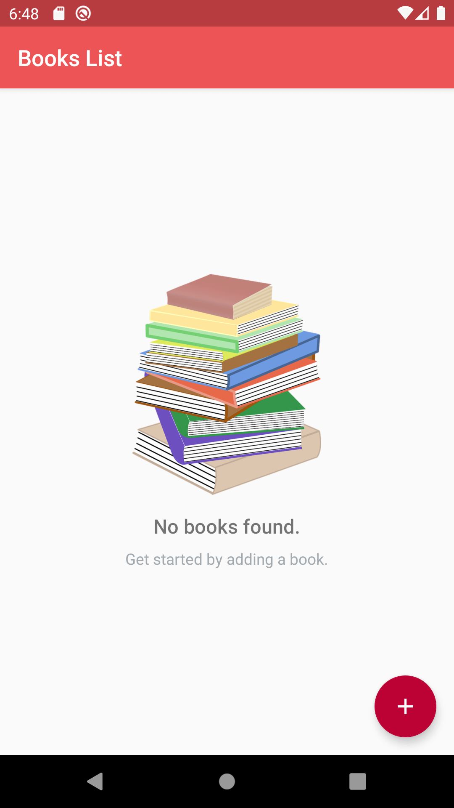
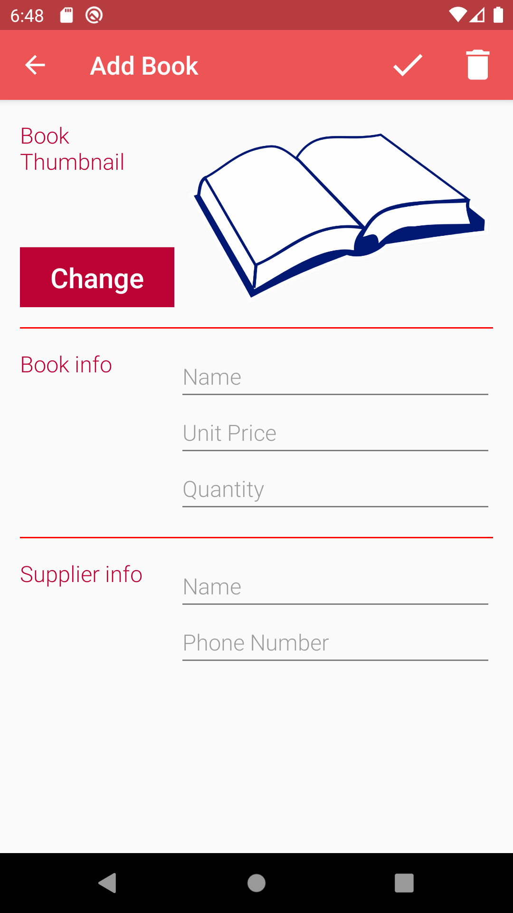
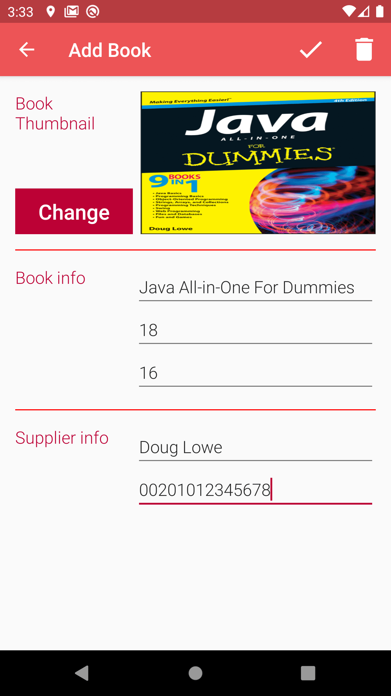
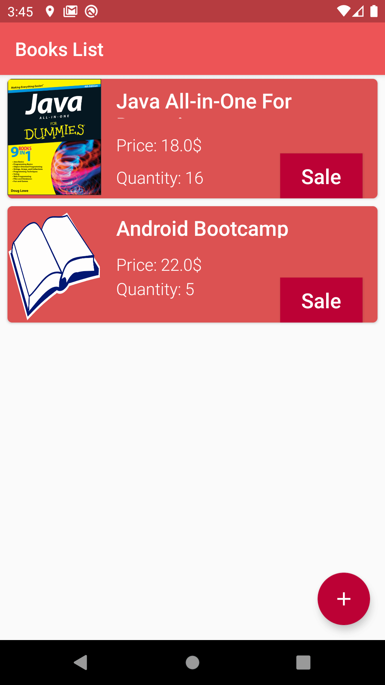
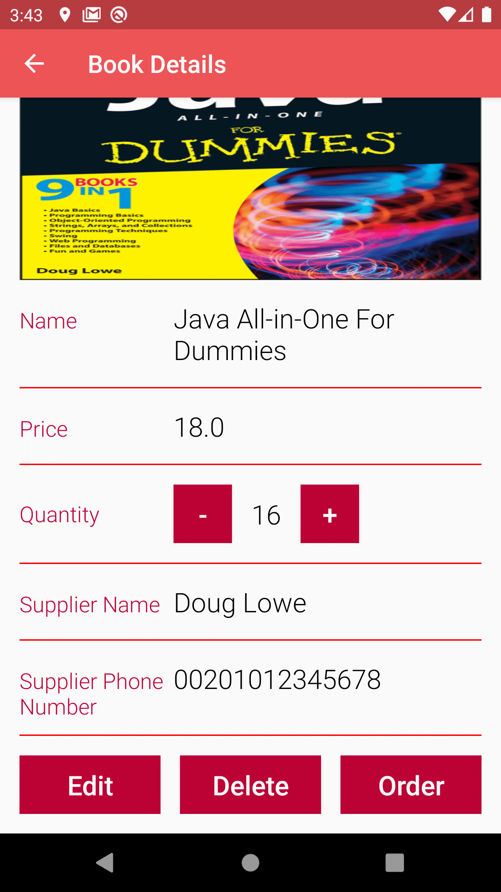
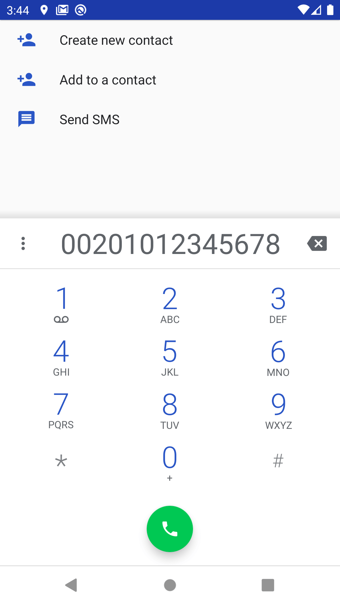
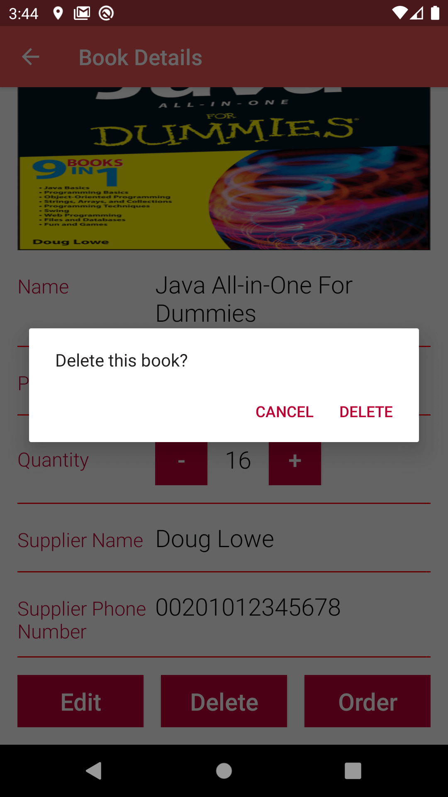

# Store-Managment-App-ABND-P7
Project #7 in Android Basics Nanodegree by Google

<h2>Project Requirements:</h2>

This project is 2 stage project.For stage 1, Create the data structure for an app that tracks the inventory of a retail store, 
including current stock and supplier information.
In the second and final stage, add to Inventory App Stage 1 by building out the UI to track the inventory of a retail store.

<h3>Empty stock, Screenshot #1</h3>

<h3>Adding new book, Screenshot #2</h3>

<h3>Adding Book details and saving, Screenshot #3</h3>

<h3>2 Books one with custom Thumbnail and the other with default thumbnail. toching a book opens book details activity. Screenshot #4</h3>

<h3>Book details activity.Touching Edit button opens Edit Activity, Screenshot #5</h3>

<h3>Edit Book Activity, Screenshot #6</h3>

<h3>Toching order button in Book details activity opens phone dialer with supplier number, Screenshot #7</h3>

<h3>Toching Delete button in Book details activity opens a dialog to confirm delete operation, Screenshot #8</h3>

